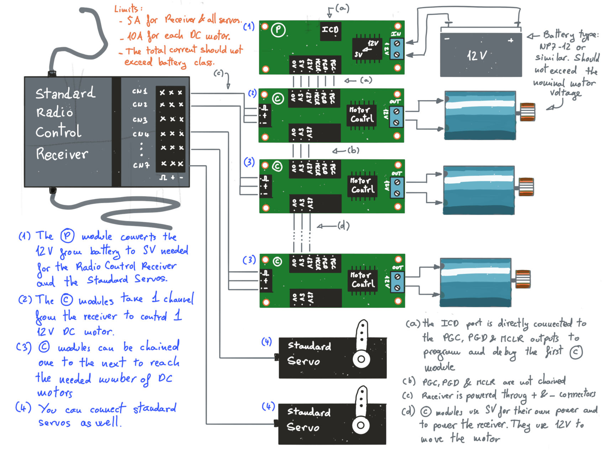

# Radio Control to DC motor controller

This kit allows to control any number of DC motors using a standard radio control receiver and a 12V battery such
an NP7-12. It is very suitable for Meccano applications

  * The (P) module converts the 12V from the battery to 5V compatible with standard modelist radio control hardware.
  * The (P) provides 5V to the rest of the system, but also passes 12V and ground from the battery.
  * The (C) modules receive 12V, 5V and ground from the (P) module. It uses the 5V for itseld and also provides it
    to the RC receiver.
  * The (C) module uses the 12V to feed the motor. 
  * You can also connect standard servos to any free output of the RC receiver.

Limits are:
  * 5A for the 5V ouput of the (P) module, that should feed the radio control receiver plus all servos.
  * Each (C) module can output up to 50A at 12V.
  * The total current should not exceed battery class.

